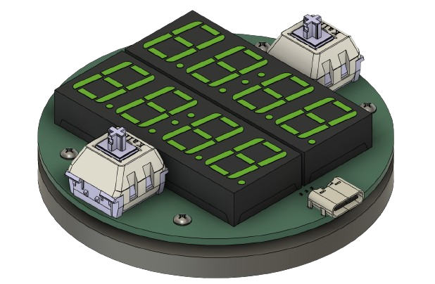

# Chess Clock
It's a simple chess clock ready to play, although it hasn't been tested yet. But the only detail I'm not sure about is the USB-C connection in the schematic and maybe some fool error with KiCad that I haven't noticed. However the C code and the circuit in simulide works.
If you want to colaborate on fixing something in the code, in the schematic or if you just want to see the circuit working with the code, all that stuff is in the folders of the repository.

> I'm trying to improve the pcb, sorry for those who saw the first commit xd.
## How to use:
There are two buttons in the bottom of the PCB. One of them is for add one to both counters. And the other one is to reset the time to 0.
Just connect, reset, set up the time and play.
## Parts:
- (1) Atmega328-AU.
- (2) Four digits 7 segement display.
- (2) Mx switches.
- (2) Hotswap sockets.
- (2) Push buttons.
- (3) 1k resistors.
- (2) 5.11K resistor.
- (1) 1M resistor.
- (1) USB-C port 6 pins.
- (3) Spacers
- (3) Screws

## Sofware I used
- Kicad.
- Fusion 360.
- Simulide.
- Microchip Studio.

Feel free to collaborate with me; I'll be very happy to talk with you. :DD
